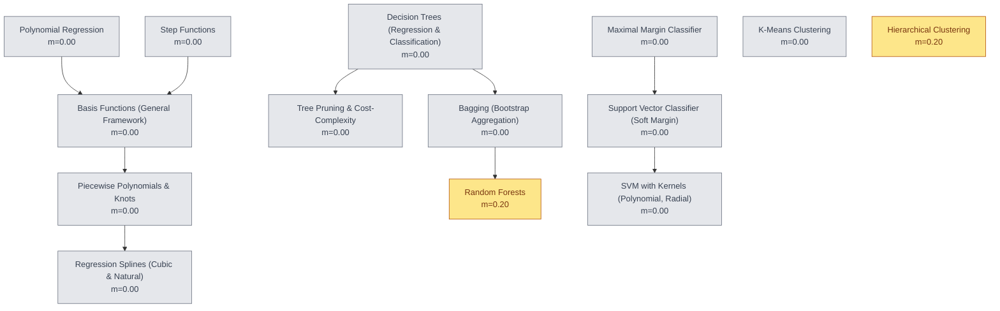
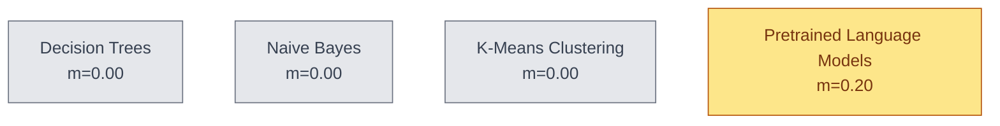
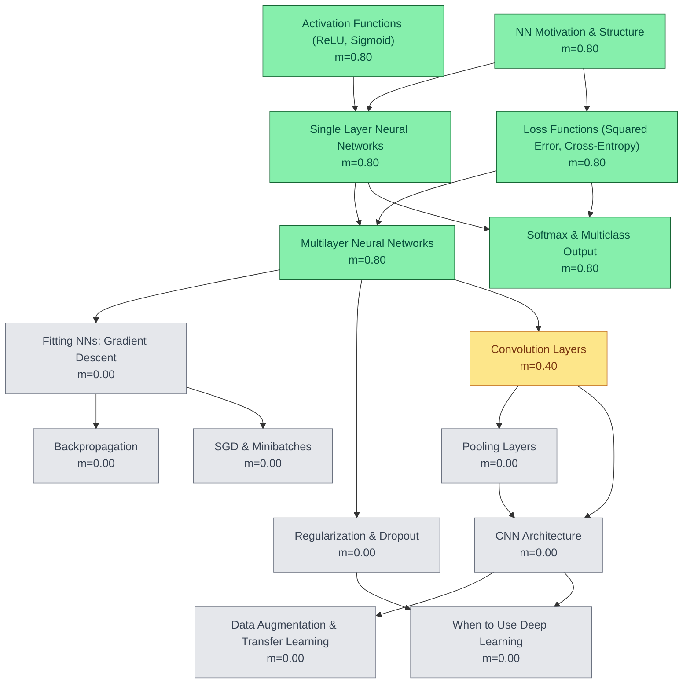
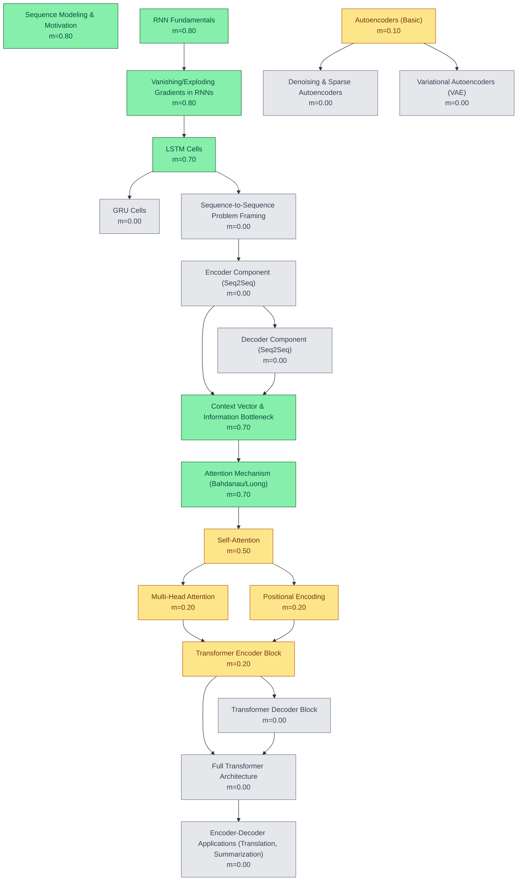
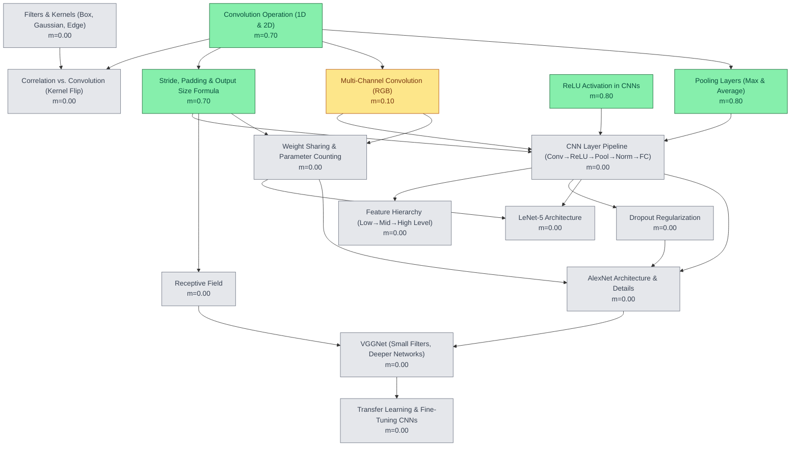
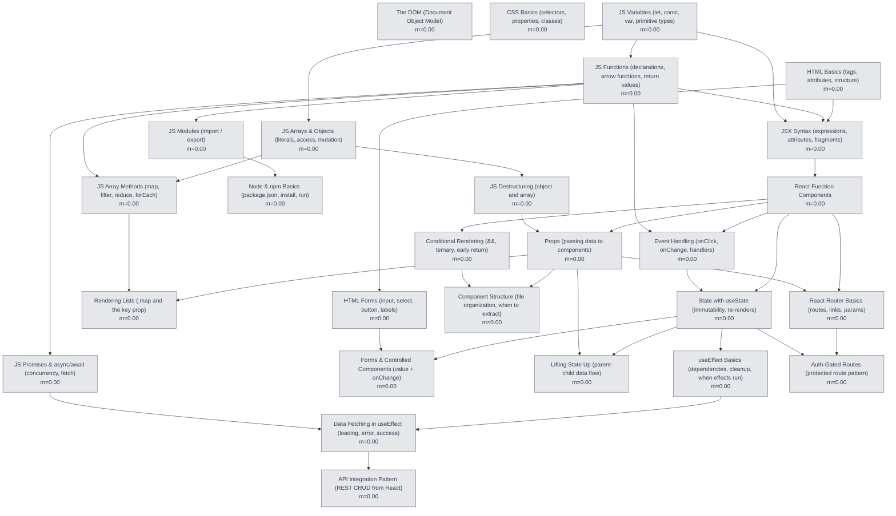

# Knowledge Graph

_Generated 2026-04-24 from `domains/*.json`. Regenerate: `python3 build_graph.py`._

**Legend** — 🟢 mastered (≥ 0.7) · 🟡 learning (0 < m < 0.7) · ⚪ untouched (m = 0)

## Summary

| Domain | 🟢 | 🟡 | ⚪ | Total |
|---|---:|---:|---:|---:|
| CMSE 381 Exam 3 — Non-Linearity, Trees, SVM, Clustering | 0 | 2 | 12 | 14 |
| CMSE 404 Exam 3 — Non-Transformer Topics | 0 | 1 | 3 | 4 |
| Neural Networks (CMSE 381) | 6 | 1 | 8 | 15 |
| Encoder-Decoder Architecture (CMSE 404) | 6 | 5 | 9 | 20 |
| IAM & SSO Group Sync | 0 | 3 | 23 | 26 |
| Intro to AI | 2 | 2 | 12 | 16 |
| CNNs (CSE 440) | 4 | 1 | 11 | 16 |
| React Front-End Fundamentals | 0 | 0 | 27 | 27 |

## CMSE 381 Exam 3 — Non-Linearity, Trees, SVM, Clustering
_Goal: Master ISLP Ch 7-9, 12 for CMSE 381 Midterm 3 (2026-04-20). NN/CNN topics covered separately in data_science_methods_nn domain._

## CMSE 404 Exam 3 — Non-Transformer Topics
_Goal: Master Decision Trees, Naive Bayes, Clustering, Pretrained LMs for CMSE 404 Exam 3 (2026-04-09)_

## Neural Networks (CMSE 381)
_Goal: Master ISLP Chapter 10 for CMSE 381 Lectures 29-31_

## Encoder-Decoder Architecture (CMSE 404)
_Goal: Master encoder-decoder and transformer fundamentals for CMSE 404 Exam 3_

## IAM & SSO Group Sync
_Goal: Build conceptual foundation for the sso_group_sync project_

```mermaid
flowchart TD
    identity_provider["Identity Provider (IdP)<br/>m=0.55"]
    service_provider["Service Provider (SP)<br/>m=0.15"]
    principal["Principal<br/>m=0.00"]
    authn_vs_authz["Authentication vs Authorization<br/>m=0.05"]
    source_of_truth["Source of Truth<br/>m=0.00"]
    schema["Schema<br/>m=0.00"]
    entitlement["Entitlement<br/>m=0.00"]
    provisioning_deprovisioning["Provisioning & Deprovisioning<br/>m=0.00"]
    rbac["Role-Based Access Control (RBAC)<br/>m=0.00"]
    principle_of_least_privilege["Principle of Least Privilege<br/>m=0.00"]
    idempotency["Idempotency<br/>m=0.00"]
    polling_vs_webhooks["Polling vs Webhooks<br/>m=0.00"]
    attribute_mapping["Attribute Mapping<br/>m=0.00"]
    eventual_consistency["Eventual Consistency<br/>m=0.00"]
    saml["SAML (Security Assertion Markup Language)<br/>m=0.00"]
    oauth2["OAuth 2.0<br/>m=0.00"]
    scim["SCIM (System for Cross-domain Identity Management)<br/>m=0.00"]
    group_sprawl["Group Sprawl<br/>m=0.00"]
    identity_fragmentation["Identity Fragmentation<br/>m=0.00"]
    drift["Drift<br/>m=0.00"]
    orphaned_access["Orphaned Access<br/>m=0.00"]
    api_rate_limiting["API Rate Limiting<br/>m=0.00"]
    audit_trail["Audit Trail<br/>m=0.00"]
    oidc["OpenID Connect (OIDC)<br/>m=0.00"]
    reconciliation["Reconciliation<br/>m=0.00"]
    zero_trust["Zero Trust<br/>m=0.00"]
    principal --> entitlement
    identity_provider --> provisioning_deprovisioning
    service_provider --> provisioning_deprovisioning
    principal --> provisioning_deprovisioning
    principal --> rbac
    entitlement --> rbac
    entitlement --> principle_of_least_privilege
    schema --> attribute_mapping
    source_of_truth --> eventual_consistency
    authn_vs_authz --> saml
    identity_provider --> saml
    service_provider --> saml
    authn_vs_authz --> oauth2
    provisioning_deprovisioning --> scim
    schema --> scim
    attribute_mapping --> scim
    rbac --> group_sprawl
    provisioning_deprovisioning --> group_sprawl
    source_of_truth --> identity_fragmentation
    identity_provider --> identity_fragmentation
    source_of_truth --> drift
    eventual_consistency --> drift
    provisioning_deprovisioning --> orphaned_access
    principle_of_least_privilege --> orphaned_access
    polling_vs_webhooks --> api_rate_limiting
    entitlement --> audit_trail
    rbac --> audit_trail
    oauth2 --> oidc
    source_of_truth --> reconciliation
    idempotency --> reconciliation
    drift --> reconciliation
    scim --> reconciliation
    principle_of_least_privilege --> zero_trust
    authn_vs_authz --> zero_trust

    classDef mastered fill:#86efac,stroke:#166534,color:#064e3b;
    classDef learning fill:#fde68a,stroke:#b45309,color:#78350f;
    classDef untouched fill:#e5e7eb,stroke:#6b7280,color:#374151;
    class identity_provider,service_provider,authn_vs_authz learning;
    class principal,source_of_truth,schema,entitlement,provisioning_deprovisioning,rbac,principle_of_least_privilege,idempotency,polling_vs_webhooks,attribute_mapping,eventual_consistency,saml,oauth2,scim,group_sprawl,identity_fragmentation,drift,orphaned_access,api_rate_limiting,audit_trail,oidc,reconciliation,zero_trust untouched;
```

## Intro to AI
_Goal: Final exam on 2026-05-01 — surface familiarity with all 13 topics in final_topics.md, confident on step-by-step computation_

```mermaid
flowchart TD
    search_basics["Uninformed Search (BFS/DFS/UCS)<br/>m=0.00"]
    probability_basics["Probability Basics (joint, conditional, marginal)<br/>m=0.00"]
    linear_algebra_basics["Linear Algebra for ML (dot products, matrix mul)<br/>m=0.00"]
    a_star_search["A* Search Traversal and Calculation<br/>m=0.60"]
    expectimax["Expectimax<br/>m=0.80"]
    mdps["MDPs (states, actions, rewards, discount)<br/>m=0.00"]
    mdp_values["Compute MDP Values (value iteration)<br/>m=0.00"]
    markov_stationary["Markov Stationary Distribution<br/>m=0.00"]
    joint_from_prior["Calculating Joint Values from Prior<br/>m=0.20"]
    supervised_vs_unsupervised["Supervised vs Unsupervised Learning<br/>m=0.00"]
    data_augmentation["Data Augmentation<br/>m=0.00"]
    minibatch_epoch["Mini-batch and Epoch<br/>m=0.00"]
    filter_output["Calculating CNN Filter Output Size<br/>m=0.80"]
    mlp_lr_computation["MLP and Logistic Regression Full Computation<br/>m=0.00"]
    ce_loss["Computing Cross-Entropy Loss<br/>m=0.00"]
    gan_objective["GAN Objective Function Conversion<br/>m=0.00"]
    search_basics --> a_star_search
    search_basics --> expectimax
    probability_basics --> mdps
    mdps --> mdp_values
    probability_basics --> markov_stationary
    probability_basics --> joint_from_prior
    supervised_vs_unsupervised --> data_augmentation
    supervised_vs_unsupervised --> minibatch_epoch
    linear_algebra_basics --> filter_output
    linear_algebra_basics --> mlp_lr_computation
    supervised_vs_unsupervised --> mlp_lr_computation
    probability_basics --> ce_loss
    ce_loss --> gan_objective
    mlp_lr_computation --> gan_objective

    classDef mastered fill:#86efac,stroke:#166534,color:#064e3b;
    classDef learning fill:#fde68a,stroke:#b45309,color:#78350f;
    classDef untouched fill:#e5e7eb,stroke:#6b7280,color:#374151;
    class expectimax,filter_output mastered;
    class a_star_search,joint_from_prior learning;
    class search_basics,probability_basics,linear_algebra_basics,mdps,mdp_values,markov_stationary,supervised_vs_unsupervised,data_augmentation,minibatch_epoch,mlp_lr_computation,ce_loss,gan_objective untouched;
```

## CNNs (CSE 440)
_Goal: Master CNNs for CSE 440 quiz (2026-04-09) and final exam (2026-05-01)_

## React Front-End Fundamentals
_Goal: Build a CRUD admin dashboard front-end for the sso_group_sync project (assumed scope; confirm with project owner). Includes JS/HTML/tooling prerequisites — Mark is at JS-zero per 2026-04-11 calibration._

